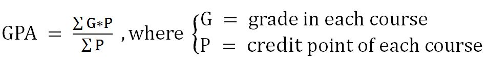

Grade Point Average (GPA) is the measure used to summarise your academic achievement at Griffith. After the publication of final grades each trimester, your Program and Career GPA are calculated, and will be used by the University to inform decisions, including the following:
 * academic progression
 * admission to advanced studies (e.g. honours) 
 * eligibility for prizes, University Medal, Award for Academic Excellence, and scholarships
 * accreditation and quality assurance.
 
Your GPA is the weighted average for all your course grades and is calculated across your total period of study in your program and career (includes all programs of enrolment at the non-award, undergraduate or postgraduate career).
 
The weighted average reflects the relative contribution made by all the courses you have undertaken based on their credit value.
 
Your GPA is calculated in two steps:
 1. The grade awarded for each course is multiplied by the credit value for each course. 
 2. The aggregate score is divided by the total number of credits for all courses completed in the defined period of study.
 
 
 The formula used to calculate your GPA is as follows:
 
 
 This introduction was taken from:
 [here](https://studenthelp.secure.griffith.edu.au/app/answers/detail/a_id/1829/~/what-does-gpa-%28grade-point-average%29-mean-and-how-is-it-calculated%3F).
